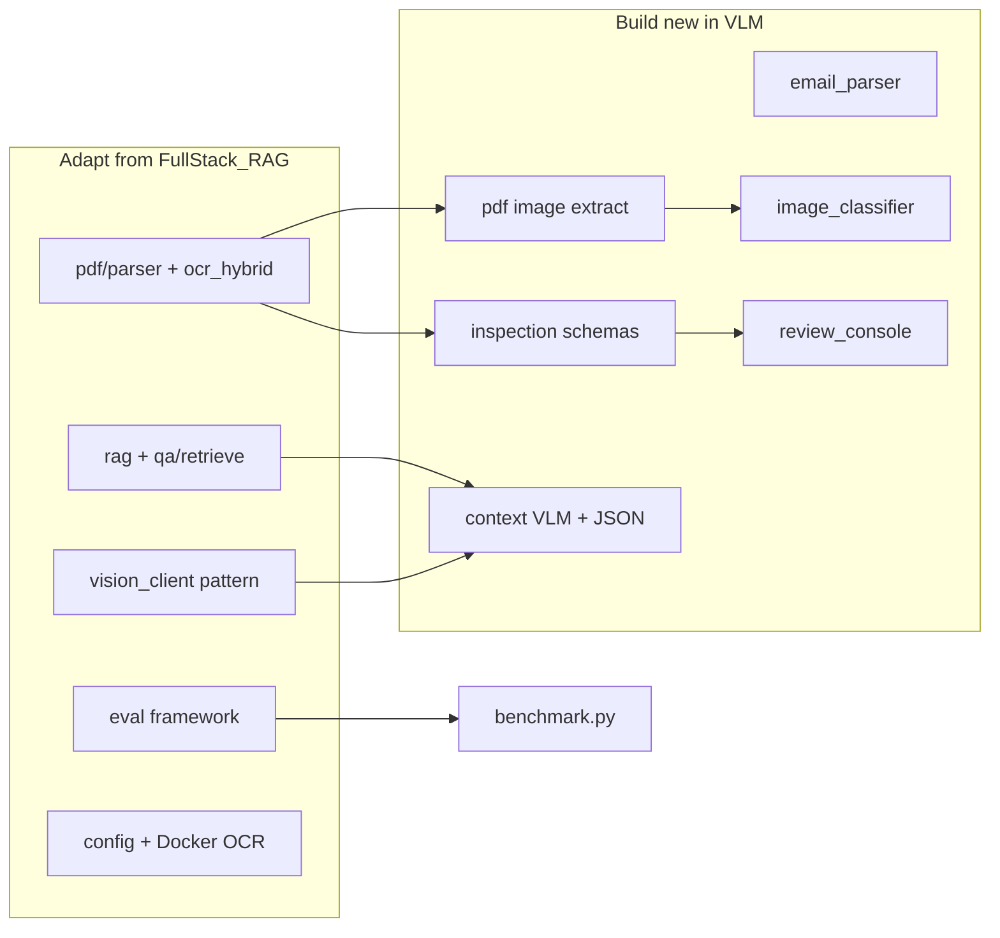

# Existing Assets — FullStack_RAG Reuse Audit

Audit of the sibling workspace for components reusable by the Construction Site Defect Vision System (training data pipeline and tooling).

**Audited project:** `c:\Software\PythonProject\fullstackRAG\FullStack_RAG`  
**Note:** The path `c:\Software\PythonProject\fullstack_RAG` does not exist. The actual repo is `fullstackRAG/FullStack_RAG`.

**Related plan:** [initial_plan.md](initial_plan.md) (final)  
**Concise reuse map:** `docs/reuse_map.md` (to be created from this audit)

---

## Executive Summary

FullStack_RAG is a full-stack **document-centric RAG agent** (FastAPI + React) built for **tender/construction contract Q&A**, not site-photo quality inspection.

| Strength | Gap |
|----------|-----|
| PDF text parsing, hybrid OCR, chunking, embedding | Email parsing |
| Hybrid retrieval (BM25 + vector + RRF) | Embedded image extraction from PDFs |
| Structured extraction patterns, Pydantic schemas | Per-image quality reasoning |
| Evaluation framework (OCR benchmark + mission eval) | Inspection-specific schemas |
| Basic vision (Ollama llava, Azure vision client) | Human review for findings |
| Config/deployment patterns | True multimodal image embeddings |

**Verdict:** Roughly **40–50% of training-pipeline plumbing** can be adapted (PDF ingest, eval, config, vision clients for labeling). The final product is an **image-only defect classifier** — RAG/multimodal reasoning at inference is out of scope. New work: image extraction, dataset builder, training loop, photo-only inference API.

**Recommended approach:** Cherry-pick modules into `VLM/`; do not fork the whole app.

---

## Project Overview

| Layer | Technology |
|-------|------------|
| Backend | Python 3.11+, FastAPI, Pydantic v2 |
| Agent | LangChain 0.3.x, LangGraph, ReAct |
| LLM (dev) | Ollama (`lfm2`, `llava` vision) |
| LLM (prod) | Azure OpenAI (`gpt-5.4-mini`, `text-embedding-3-small`) |
| Vector DB | MongoDB (Atlas vector search + local cosine fallback) |
| PDF | PyMuPDF, Tesseract, optional MinerU |
| DOCX | python-docx |
| Frontend | React + Vite, SSE streaming chat |
| Eval | Custom mission runner + pytest harnesses |
| Deploy | `Dockerfile.tesseract-ocr`, K8s-oriented OCR docs |

Key dependency file: `fullstackRAG/FullStack_RAG/backend/requirements.txt`

---

## Reuse Map vs VLM Requirements

| VLM requirement | FullStack_RAG status | Gap severity |
|-----------------|---------------------|--------------|
| PDF ingestion & parsing | Strong: hybrid OCR, structured parse, chunk, embed | Small — no RFI form-field model |
| Email ingestion | Not present (email regex only in `extractionservice.py`) | Large |
| Image extraction from PDF | Not in production pipeline; benchmark GT has `images` section | Large |
| Image routing (photo/drawing/noise) | `image_coverage` used for OCR routing only | Large |
| Multimodal RAG (metadata + images) | Text RAG + caption-proxy image search | Large |
| VLM reasoning with context | Generic one-shot image describe | Large |
| Structured JSON output | Patterns in tender_qa + eval scorers; no inspection schema | Medium |
| Evaluation / benchmarking | Strong: OCR benchmark + mission eval framework | Small — need labeled RFIs |
| Human review workflows | Document relationship accept/reject only | Large |
| Inspection schemas | Not present | Large |
| Confidence policy | QA `confidence_band` + verification | Medium — adapt for image review |
| Audit trail | Tender QA append-only events; eval run storage | Medium — adapt, not drop-in |

---

## High-Value Reuse (copy/adapt)

### PDF pipeline

| Path | What it does | Reuse |
|------|--------------|-------|
| `backend/pdf/parser.py` | PyMuPDF per-page text + section/heading heuristics | HIGH |
| `backend/pdf/ocr_hybrid_routing.py` | Per-page route: embedded / Tesseract / MinerU; `image_coverage` signal | HIGH |
| `backend/pdf/ocr_hybrid_pipeline.py` | Hybrid OCR orchestration → markdown → reindex | HIGH |
| `backend/pdf/ocr_ingest.py` | OCR ingest entry point | HIGH |
| `backend/pdf/ocr_hybrid_config.py` | Tunable hybrid OCR config | HIGH |
| `backend/pdf/chunker.py` | Page-aware chunking with citation metadata | HIGH |
| `backend/pdf/service.py` | PDF persist, chunk, embed pipeline | HIGH |
| `backend/pdf/schemas.py` | Pydantic API models | HIGH |
| `backend/documents/batch_upload.py` | Fail-fast multi-PDF/DOCX upload | HIGH |
| `backend/documents/upload_strict.py` | Reject empty/corrupt/unsearchable docs | HIGH |
| `docs/pdf-hybrid-extraction.md` | Hybrid OCR documentation | HIGH |

**Adaptation:** Add PyMuPDF `page.get_images()` / xref extraction → save assets → link to `inspection_id`. Benchmark GT in `backend/pdf/ocr_benchmark_gt_schema.py` already models per-page images for eval but production ingest does not wire extraction.

### RAG and retrieval

| Path | What it does | Reuse |
|------|--------------|-------|
| `backend/rag/ingest.py` | Chunk → embed → Mongo | HIGH |
| `backend/rag/retriever.py` | Scoped semantic search (`pdf_id`, filename filters) | HIGH |
| `backend/rag/mongo_vector_compat.py` | Local cosine + BM25 + RRF hybrid | HIGH |
| `backend/qa/retrieve.py` | Wiki-first + scoped chunks + citations + verification | HIGH |
| `backend/qa/bm25_retrieval.py` | Tender-aware BM25 tokenization | MEDIUM–HIGH |
| `backend/qa/rerank.py` | Candidate reranking | HIGH |
| `backend/qa/verify.py` | Evidence verification | HIGH |
| `backend/qa/citations.py` | Citation registry | HIGH |

**Adaptation:** Scope by `inspection_id` instead of `pdf_id`; assemble `ContextPack` before VLM call.

### VLM and vision

| Path | What it does | Reuse |
|------|--------------|-------|
| `backend/image_analysis.py` | Ollama vision `/api/chat` with base64 image (dev) | HIGH |
| `backend/captcha/vision_client.py` | Azure OpenAI vision (prod pattern) | HIGH |
| `backend/multimodal_image/indexing.py` | Caption → embed → Mongo per image | HIGH |
| `backend/multimodal_image/search_ops.py` | Text→caption-embedding search | MEDIUM–HIGH |
| `backend/llm/chat.py` | Ollama / Azure chat factory | HIGH |
| `backend/llm/embeddings.py` | Provider-agnostic embeddings | HIGH |

**Caveat:** `multimodal_image/indexing.py` uses `embedding_mode: caption_proxy_v1` — caption embedding stored as image embedding. Suitable for text search over captions, not visual similarity of site photos without CLIP/SigLIP upgrade.

### Schemas and audit patterns

| Path | What it does | Reuse |
|------|--------------|-------|
| `backend/documentthreads/schemas.py` | `DocumentProfile`, relationships, accept/reject review API, `ConfidenceBand`, `ExtractionProvenance` | HIGH |
| `backend/tender_qa/store.py` | Append-only Mongo events with dedup + provenance | MEDIUM |
| `backend/tender_qa/extract.py` | Heuristic + LLM JSON extraction of Q/A events | MEDIUM |
| `backend/tender_qa/metadata.py` | Date/revision extraction from headers | MEDIUM |

### Evaluation

| Path | What it does | Reuse |
|------|--------------|-------|
| `backend/eval/` (21 files) | Mission definitions, scoring pipeline, `/eval` API | HIGH |
| `backend/eval/scoring/builtin.py` | `contains_required_fields`, JSON extraction from LLM output | HIGH |
| `backend/pdf/ocr_benchmark*.py` | CER/WER/table/image GT benchmark harness | HIGH |
| `backend/pdf/ocr_benchmark_gt_schema.py` | GT JSON with `text`, `images`, `tables` sections | MEDIUM |
| `benchmark_test_set/` | Labeled PDF test corpus | HIGH |

### Config and deployment

| Path | What it does | Reuse |
|------|--------------|-------|
| `config.yaml` | Base env defaults | HIGH |
| `config/environments/` | `dev.yaml`, `production.yaml` | HIGH |
| `backend/config.py` | YAML + `.env` loader | HIGH |
| `Dockerfile.tesseract-ocr` | OCR-ready API container | MEDIUM |
| `docs/pdf-ocr-kubernetes.md` | K8s OCR deployment | MEDIUM |

---

## Medium Reuse (patterns, not drop-in)

| Path | What it does | Reuse |
|------|--------------|-------|
| `backend/documentthreads/extractionservice.py` | Regex entities (emails, URLs, ticket-like IDs) | MEDIUM |
| `backend/documentthreads/profileservice.py` | Deterministic metadata extraction | MEDIUM |
| `backend/eval/wiki_qa_eval.py` | Deterministic QA eval cases (no Mongo) | MEDIUM |
| `frontend/src/api.js` | SSE chat, upload API client | MEDIUM |
| `frontend/src/App.jsx` | Upload UI shell | MEDIUM |

---

## Low Reuse (do not copy)

| Area | Why |
|------|-----|
| `backend/agent/*` (ReAct, scraping, scheduler) | Overkill for deterministic inspection pipeline |
| `backend/wiki/*` | Tender wiki compile — domain-specific |
| `backend/tender_qa/` (domain logic) | Tender Q&A, not inspection quality |
| `backend/excel/*` | Unrelated |
| `backend/reconstruction/*` | 3D photogrammetry, not 2D defect QA |
| `backend/image_gen/*` | Text-to-image generation |
| `backend/captcha/*` (except `vision_client.py`) | CAPTCHA solving |
| `backend/scrape_*`, Playwright tools | Web scraping |
| Full monorepo import | 500+ backend Python files; cherry-pick only |

---

## Must Build New (not in FullStack_RAG)

| Component | VLM target | Notes |
|-----------|------------|-------|
| Email parser | `ingestion/email_parser.py` | No `.eml`/MSG support; use `mail-parser` or Graph API |
| PDF image extraction | New module on top of `pdf/parser.py` | Biggest functional gap |
| Image type router | `routing/image_classifier.py` | Site photo vs drawing vs logo/stamp |
| Inspection schemas | `schemas/inspection.py`, `image.py`, `finding.py`, `audit.py` | Not present in sibling repo |
| Context-conditioned reasoner | `reasoning/prompts.py`, `vlm_client.py` | Quality judgment with work-stage context |
| Confidence policy | `reasoning/confidence_policy.py` | Image-level review routing |
| Review console | `ui/review_console.py` | Finding-level queue with override capture |
| True multimodal embeddings | `rag/indexer.py` upgrade | CLIP/SigLIP if visual similarity needed |
| CV defect detector | `detection/defect_detector.py` | YOLO/U-Net — not present |

---

## Blockers and Risks

| Risk | Detail |
|------|--------|
| Path mismatch | Project is `fullstackRAG/FullStack_RAG`, not `fullstack_RAG` |
| No LICENSE file | No `LICENSE` found in repo root — clarify reuse terms before copying |
| MongoDB coupling | Vector store, profiles, multimodal assets all Mongo-specific |
| LangChain lock-in | Pinned LangChain 0.3.x / LangGraph 0.2.x in `requirements.txt` |
| No PDF image extraction | Hybrid OCR treats images as layout signal, not extractable assets |
| Vision split | Ollama, Azure, caption-only indexing — no unified VLM layer |
| Caption-proxy multimodal RAG | Not suitable for visual similarity without upgrade |
| Domain hooks in ingest | `batch_upload.py` fires tender wiki + docx profile hooks — strip for inspection |
| External MinerU dependency | Production OCR may require `PDF_OCR_FILE_PARSE_URL` HTTP service |
| Monorepo weight | Many unrelated features — cherry-pick modules only |

---

## Integration Map



---

## Phase Alignment with initial_plan.md

| Phase | Reuse from FullStack_RAG | Build new in VLM |
|-------|--------------------------|------------------|
| **1 — Schema & parsing MVP** | `pdf/parser.py`, `ocr_hybrid_routing.py`, `upload_strict.py`, Pydantic patterns from `documentthreads/schemas.py` | Image extraction module, `InspectionRecord` schema |
| **2 — Single-image reasoning MVP** | `image_analysis.py`, `captcha/vision_client.py` | Context prompts, structured `FindingRecord` output |
| **3 — Retrieval & calibration** | `rag/ingest.py`, `mongo_vector_compat.py`, `qa/retrieve.py` | `ContextPack` assembly, `inspection_id` scoping |
| **4 — Benchmarking & human review** | `eval/`, `ocr_benchmark*`, `scoring/builtin.py` | Labeled RFI set, defect metrics, review console |
| **5 — Optional defect localization** | — | YOLO/U-Net integration |
| **6 — Production hardening** | `config.yaml`, Docker OCR, audit patterns from `tender_qa/store.py` | Drift monitoring, access control |

---

## Priority Shortlist (start Phase 1)

1. `backend/pdf/parser.py` + `ocr_hybrid_routing.py` — parse sample RFI PDF
2. **New module** — PyMuPDF image extraction (benchmark GT proves concept; ingest not wired)
3. `backend/documents/upload_strict.py` — upload validation pattern
4. `backend/documentthreads/schemas.py` — Pydantic modeling conventions
5. `backend/qa/citations.py` + `retrieve.py` — provenance pattern for Phase 3 RAG
6. `backend/eval/scoring/builtin.py` — structured JSON output validation
7. `backend/captcha/vision_client.py` — Azure VLM for production benchmarking

---

## Key Directory Map (FullStack_RAG)

```text
FullStack_RAG/
├── README.md
├── config.yaml
├── config/environments/          # dev.yaml, production.yaml
├── benchmark_test_set/           # OCR benchmark PDFs + ground truth
├── backend/
│   ├── main.py                   # FastAPI app
│   ├── config.py
│   ├── llm/                      # chat.py, embeddings.py
│   ├── pdf/                      # parser, OCR, chunk, benchmark (30 files)
│   ├── rag/                      # ingest, retriever, mongo_vector_compat
│   ├── qa/                       # hybrid retrieval, rerank, verify, citations
│   ├── tender_qa/                # Q&A event extraction (domain-specific)
│   ├── documentthreads/          # profiles, relationships, review API
│   ├── multimodal_image/         # /mm upload, caption, search
│   ├── image_analysis.py         # POST /api/analyze-image (Ollama vision)
│   ├── captcha/vision_client.py  # Azure vision chat
│   ├── documents/                # batch_upload, upload_strict
│   ├── eval/                     # Mission eval API + scoring
│   └── agent/                    # ReAct, flows, skills (low reuse)
├── frontend/src/                 # Chat UI, scheduler, uploads
└── docs/                         # Architecture, PDF OCR, eval
```

---

## Summary

FullStack_RAG provides an excellent foundation for **PDF text ingestion, hybrid RAG, evaluation, and config**. It does **not** provide email parsing, embedded photo extraction, inspection schemas, context-conditioned quality reasoning, or finding-level human review.

Highest-ROI path: extract and adapt PDF, RAG, eval, and vision-client modules into the `VLM/` structure defined in [initial_plan.md](initial_plan.md), then build the inspection-specific layers on top.
