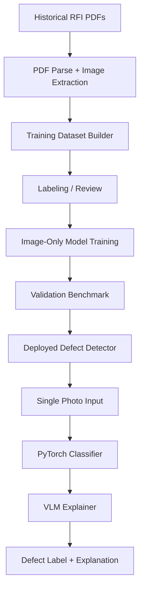
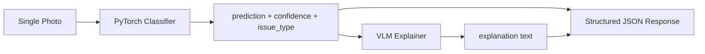

# Construction Site Defect Vision System — Training Plan

## Purpose

Build a vision system that learns from historical construction inspection PDFs and their embedded photos so that, at final deployment, the system can judge **a single image** and detect whether it shows a construction defect or quality issue.

The PDF/RFI pipeline is for **training data creation**, not for inference-time input. In the final use case, the model receives only a picture.

**Reference input:** `J3968-Inspection-ARC-000002A_completed.pdf` — a completed RFI used to extract site photos, inspection context, and labels for training.

**Reuse audit source:** [existing_assets.md](existing_assets.md) contains the full analysis of what can be reused from the sibling workspace.

---

## Known Risks and Constraints

The pivot to image-only inference is coherent if the product requirement is truly **one photo in, defect/no-defect out**.

The main risk is that some inspection photos are only meaningful when work stage is known — for example, water visible during a flooding test before waterproofing may be expected rather than defective. An image-only model cannot use that context at runtime. The labeling protocol must handle stage-dependent photos explicitly (see [Stage-dependent image policy](#stage-dependent-image-policy)) before dataset building begins.

---

## Target Use Case

At deployment time, the system should:

1. Receive one photo.
2. Detect whether the photo contains a construction defect or quality problem.
3. Return a defect label, confidence, and a **natural-language explanation** of what is visible and why it is or is not a problem.

No form text, comments, email chain, or PDF metadata is required at final inference.

---

## Design Principles

1. **Training and inference are different.** PDFs and metadata are for dataset creation, not mandatory runtime input.
2. **The model must learn visual cues directly.** The final classifier should work from image only.
3. **Metadata is supervision.** Inspection records help create labels and training signals.
4. **Human review remains essential.** The system is decision support, especially for borderline cases.
5. **Reuse existing plumbing.** Existing PDF parsing, retrieval, evaluation, and vision-client patterns should be adapted for training data generation.
6. **Stage-dependent photos need explicit policy.** If the image's acceptability depends on work stage, the dataset must mark that clearly instead of forcing a misleading binary label.
7. **Separate decision from wording.** The PyTorch classifier owns defect/no-defect; the VLM owns natural-language explanation. Both use the image only at inference.

---

## Problem Framing

The historical inspection PDFs contain useful context such as work type, inspection outcome, and comments. That context is valuable because it helps identify which images are defective and which are acceptable.

However, the final production model will not receive that context. It must learn from the image itself and generalize to new photos.

This means the project has two distinct layers:

- **Training pipeline**: parse PDFs, extract images, attach labels, build datasets.
- **Inference pipeline**: classify a single image with a PyTorch model, then generate a plain-language explanation with a VLM (image only — no PDF metadata).

---

## System Overview



---

## Recommended Architecture

The best architecture has three parts:

1. **Data preparation pipeline** — ingest historical RFIs, extract images, and create labeled training examples.
2. **Image-only defect model (training)** — train a PyTorch classifier or detector that learns from photos and labels.
3. **Inference (deployment)** — PyTorch classifier for the defect decision; VLM for natural-language explanation (see [Inference: Classifier + VLM Explanation](#inference-classifier--vlm-explanation)).

The classifier makes the primary defect/no-defect call. The VLM turns what is visible into words. Neither step uses RFI text or PDF metadata at runtime.

---

## Technology Stack

| Layer | Technology | Role |
|-------|------------|------|
| **Language** | Python 3.11+ | All pipelines |
| **Training data** | PyMuPDF, Pillow, Pydantic | PDF parse, image extract, schemas, manifests |
| **Storage (Phase 1 decision)** | JSON manifests + optional MongoDB | Dataset records; Mongo if reusing FullStack_RAG patterns |
| **Classifier training** | **PyTorch** + torchvision or `timm` | Defect / no-defect model (primary inference decision) |
| **Localization (Phase 3, optional)** | PyTorch + Ultralytics YOLO or similar | Crack/spalling bounding boxes |
| **Explanation (inference)** | **VLM** via Ollama (dev) or Azure/Gemini vision (prod) | Image-only natural-language explanation |
| **Explanation fallback** | Template strings from `issue_type` | When VLM unavailable or low-latency path needed |
| **Inference API** | FastAPI | `deployment/inference_service.py` |
| **Metrics / calibration** | scikit-learn, custom eval scripts | Benchmark, confidence thresholds |
| **Labeling assist (training only)** | FullStack_RAG vision clients (`image_analysis.py`, `vision_client.py`) | Pre-label bootstrap, review tooling — not production defect decision |

### What is *not* the production defect decision

- **VLM alone** — flexible wording but less reliable for calibrated defect/no-defect calls; not the primary classifier.
- **PDF metadata / RAG at inference** — used only to create training labels, not passed to the deployed API.
- **FullStack_RAG ReAct agent** — tooling reuse only.

### Dependencies (to add in VLM repo)

```text
# Training
torch, torchvision, timm, Pillow, pydantic, PyMuPDF

# Inference API
fastapi, uvicorn

# VLM explanation (pick one or both)
httpx          # Ollama dev (reuse pattern from image_analysis.py)
openai         # Azure vision prod (reuse pattern from vision_client.py)

# Eval
scikit-learn, pytest
```

---

## Inference: Classifier + VLM Explanation

At deployment, the system uses **two models** on a single photo. Both receive **only the image** (the classifier may pass its `issue_type` hint to the VLM). No RFI form, email, or inspection metadata.



### Step 1 — PyTorch classifier (primary decision)

- Input: image bytes
- Output: `prediction` (`defect` / `no_defect`), `confidence`, `issue_type`, optional `severity`
- Trained on labeled photos from the historical RFI dataset
- Owns the score used for confidence policy and review routing

### Step 2 — VLM explainer (natural language)

- Input: image bytes + optional classifier outputs (`prediction`, `issue_type`, `confidence`) as hints
- Output: `explanation` — what is visible and why it indicates a problem (or appears acceptable)
- Does **not** receive PDF metadata, work description, or inspection outcome
- Prompt must require answers grounded in **visible features only**

Example explainer prompt:

> Describe the visible construction conditions in this site photo. State whether defects such as cracks, spalling, staining, misalignment, or incomplete work are present. If defects exist, say what they are, where they appear in the image, and why they indicate a quality problem. If no defect is apparent, briefly describe what is shown and why it appears acceptable. Do not assume work-stage context not visible in the image.

### Step 3 — Fallback

If the VLM call fails or times out:

- Use a **template** from `issue_type` and `prediction`, e.g. `"Crack detected on concrete surface (confidence 0.91)."`
- Set `explanation_source: "template_fallback"`

### Model options for the explainer

| Tier | Model | Notes |
|------|--------|-------|
| Dev | Ollama `llava` / `llama3.2-vision` | Already used in FullStack_RAG `image_analysis.py` |
| Prod API | Azure OpenAI / Gemini vision | Pattern in `captcha/vision_client.py` |
| On-prem | Qwen2.5-VL, LLaVA | If local explanation required |

### Modules

| Module | Responsibility |
|--------|----------------|
| `deployment/inference_service.py` | Orchestrate classifier → explainer → JSON response |
| `deployment/vlm_explainer.py` | VLM API wrapper for image-only explanation |
| `deployment/explainer_prompts.py` | Versioned prompt templates |
| `training/image_classifier.py` | Load and serve trained PyTorch weights |

### Why not VLM-only?

A VLM can both classify and explain, but for construction QA you typically want:

- **Calibrated defect scores** from a supervised PyTorch classifier trained on your labels
- **Readable explanations** from a VLM that describes what it sees

This split keeps the decision auditable while still delivering the wording users need.

---

## Reuse From Existing Assets

The sibling `fullstackRAG/FullStack_RAG` workspace still provides valuable reusable components, but they should be used primarily for **dataset generation, evaluation, and tooling** — not as the final inference architecture. Full audit: [existing_assets.md](existing_assets.md). Concise mapping: `docs/reuse_map.md`.

### High-value reuse

| Area | Reusable parts | How to use them |
|---|---|---|
| PDF ingestion | `backend/pdf/parser.py`, `ocr_hybrid_routing.py`, `ocr_hybrid_pipeline.py`, `ocr_ingest.py`, `service.py` | Use to extract images and any training-time text metadata from historical RFIs. |
| Chunking and citations | `backend/pdf/chunker.py`, `backend/qa/citations.py` | Preserve provenance for dataset records and reviewer traceability. |
| Retrieval | `backend/rag/ingest.py`, `backend/rag/retriever.py`, `mongo_vector_compat.py`, `backend/qa/retrieve.py` | Useful for analyst tooling and label review, not required at final inference. |
| Vision client | `backend/image_analysis.py`, `backend/captcha/vision_client.py`, `backend/llm/chat.py` | Label bootstrapping, review tooling, and **production VLM explainer** integration pattern. |
| Evaluation | `backend/eval/`, `scoring/builtin.py`, `pdf/ocr_benchmark*` | Reuse for benchmark harnesses and model comparison. |
| Config and deployment | `config.yaml`, `config/environments/`, `backend/config.py`, OCR Docker pattern | Reuse environment and deployment conventions. |
| Schema patterns | `backend/documentthreads/schemas.py`, `tender_qa/store.py` | Reuse Pydantic and audit/event modeling patterns. |

### Reuse caveats

- The existing system is built around document-centric RAG and should not be treated as the final inference architecture.
- The current image embedding approach is caption-proxy and is not enough for true image-only defect learning.
- The current domain logic is tuned for tender/construction Q&A and must be stripped of tender-specific behavior.
- MongoDB is still an open storage decision in Phase 1: either adopt it for fastest reuse or define a storage abstraction before porting components.
- The repository audit did not find a `LICENSE` file, so reuse terms should be clarified before copying code.

---

## Training Data Model

### InspectionRecord

Represents one historical inspection bundle used to generate training examples.

**Fields:**

- `inspection_id`
- `project_name`
- `document_type`
- `location`
- `description_of_works`
- `subsequent_work`
- `inspection_outcome`
- `inspector_comments`
- `email_context`
- `source_document_refs`
- `created_at`
- `updated_at`

### ImageRecord

Represents one extracted photo from a historical inspection bundle.

**Fields:**

- `image_id`
- `inspection_id`
- `page_number`
- `source_ref`
- `image_path`
- `image_type`
- `ocr_text`
- `caption`
- `routing_confidence`
- `hash`

### TrainingLabel

Represents the label assigned to an image for model training.

**Fields:**

- `image_id`
- `label`
- `issue_type`
- `severity`
- `work_type`
- `label_source`
- `reviewer_id`
- `review_status`
- `notes`
- `stage_policy` — how a stage-dependent image was handled (`exclude`, `uncertain`, `stratify`, `supervised`)
- `filter_reason` — if excluded from training set (e.g. `drawing`, `logo`, `duplicate`, `stage_dependent`)

### AuditEvent

Represents a change in the training dataset lifecycle.

**Fields:**

- `event_id`
- `entity_type`
- `entity_id`
- `event_type`
- `actor`
- `timestamp`
- `before_state`
- `after_state`
- `source`

---

## Repository Structure

```text
VLM/
├── initial_plan.md
├── existing_assets.md
├── docs/
│   ├── data_schema.md
│   ├── labeling_protocol.md
│   ├── reuse_map.md
│   └── governance_notes.md
├── ingestion/
│   ├── pdf_parser.py
│   ├── email_parser.py
│   └── image_extractor.py
├── dataset/
│   ├── builder.py
│   ├── splits.py
│   └── manifests.py
├── labeling/
│   └── review_console.py
├── training/
│   ├── image_classifier.py
│   ├── detector.py
│   └── trainer.py
├── eval/
│   ├── benchmark.py
│   └── metrics.py
└── deployment/
    ├── inference_service.py
    ├── vlm_explainer.py
    └── explainer_prompts.py
```

---

## Pipeline Modules

| Module | Responsibility | Output |
|---|---|---|
| `ingestion/pdf_parser.py` | Extract structured text, page images, and embedded attachments | Parsed inspection bundles |
| `ingestion/image_extractor.py` | Extract embedded image assets from PDFs | Training image files |
| `ingestion/email_parser.py` | Parse email threads attached to inspection bundles | Email context for labeling |
| `dataset/builder.py` | Combine images with labels; apply image-type and stage-policy filters | Training dataset manifest |
| `dataset/splits.py` | Create train/val/test splits | Split manifests |
| `labeling/review_console.py` | Human inspection and override workflow | Reviewed labels |
| `training/image_classifier.py` | Train image-only classification model | Trained classifier |
| `training/detector.py` | Optional localization model | Defect detector |
| `training/trainer.py` | Orchestrate training runs | Model artifacts |
| `eval/benchmark.py` | Measure model performance | Metrics report |
| `deployment/inference_service.py` | Orchestrate classifier + VLM explainer | Full prediction JSON |
| `deployment/vlm_explainer.py` | Image-only natural-language explanation | Explanation text |
| `deployment/explainer_prompts.py` | Versioned VLM prompt templates | Prompt payloads |

---

## Decision Flow

1. Parse historical inspection PDFs.
2. Extract embedded photos.
3. Filter non-useful image types (drawings, logos, stamps, duplicates).
4. Attach inspection context for labeling only.
5. Assign image-level defect labels through human review and inspection outcomes, applying the stage-dependent image policy.
6. Build a training dataset of image + label examples.
7. Train an image-only defect classifier or detector.
8. Evaluate on held-out inspection photos.
9. Deploy an inference service that accepts a single photo and returns classifier output plus VLM explanation.

---

## Output Schema

Inference output (image-only; no metadata at runtime):

```json
{
  "image_id": "att_03",
  "prediction": "no_defect",
  "confidence": 0.86,
  "issue_type": null,
  "severity": null,
  "explanation": "The slab surface appears uniform with no visible cracks, spalling, or misalignment. Ponded water is present but no structural damage is apparent in the image.",
  "explanation_source": "vlm",
  "classifier_version": "image-classifier-1.0",
  "explainer_version": "vlm-explainer-1.0",
  "review_status": "pending"
}
```

- `prediction` and `confidence` come from the **PyTorch classifier**.
- `explanation` comes from the **VLM explainer** (or `template_fallback` if VLM unavailable).
- Text must be grounded in **visible image features only** — not inspection metadata or training-time context.

---

## Labeling Protocol

The labeling protocol should be conservative and explicit. Full detail in `docs/labeling_protocol.md`.

### Label granularity

- Label at the image level.
- Use inspection context to assign labels during dataset creation.
- Do not require metadata at inference time.

### Label classes

- `defect`
- `no_defect`
- `uncertain_requires_human_review`

### Stage-dependent image policy

Some photos are inherently work-stage dependent. For example, water visible during a flooding test before waterproofing may be expected rather than defective.

For those cases, choose one of these policies **before dataset building**:

| Policy | When to use | Effect on training |
|--------|-------------|-------------------|
| **Exclude** | Acceptability cannot be inferred from pixels alone | Image omitted from supervised set; `filter_reason: stage_dependent` |
| **Uncertain** | Ambiguous but worth keeping for review | Label `uncertain_requires_human_review`; excluded from classifier training until reviewed |
| **Stratify** | Defect cues are stable within a work type | Train separate models or balanced subsets per `work_type` |

Record the chosen policy per image in `TrainingLabel.stage_policy`.

### Issue annotation

For defect cases, record:

- `issue_type`
- `severity`
- `short_reason`
- `visible_evidence`

### Borderline handling

If the image is ambiguous or depends on work stage, label it as uncertain and send it to review.

### Reviewer policy

Reviewers should be able to override labels and add notes. Their corrections should be stored and reused for future training and calibration.

### Image type filtering

Before dataset building, filter out non-useful images such as:

- drawings
- logos
- stamps
- low-information scans
- duplicate pages

This filter should happen in `dataset/builder.py` or an upstream preprocessing step. Record exclusions in `TrainingLabel.filter_reason`.

---

## Model Strategy

Training and inference use different models for different jobs.

### Training (what to learn)

- **PyTorch image classifier** — primary defect / no-defect model trained on labeled photos.
- **Object detector or segmentation model (optional)** — localized defects in Phase 3.

### Inference (what to run)

- **PyTorch classifier** — defect decision and confidence (see [Inference: Classifier + VLM Explanation](#inference-classifier--vlm-explanation)).
- **VLM explainer** — natural-language description and rationale from the image only.
- **Template fallback** — if VLM is unavailable.

### Recommended progression

1. Train a strong baseline PyTorch classifier.
2. Wire VLM explainer on the inference API (image-only prompts).
3. Add localization only if it improves measurable defect detection.
4. Use label review to improve hard cases.

The inference path should not depend on RFI text, email comments, or inspection metadata. The VLM receives only the photo (plus optional classifier hints).

---

## Confidence Policy

A confidence policy should sit between model output and review routing.

### Suggested rules

- `confidence >= 0.85`: auto-accept model output for review queueing, unless severity is high.
- `0.60 <= confidence < 0.85`: route to standard human review.
- `confidence < 0.60`: mark uncertain and prioritize review.
- Any predicted defect should be reviewed if the risk is high.

### Why this matters

Construction defect detection is sensitive to false rejects and missed defects. Confidence calibration is more valuable than a single raw score.

---

## Evaluation Plan

| Layer | Metrics |
|---|---|
| Dataset quality | Label agreement, class balance, uncertain rate, stage-dependent exclusion rate |
| Classification | Precision, recall, F1, AUROC |
| Localization | IoU, mAP if using detection |
| Explanation | Human eval for clarity, grounding, and hallucination rate |
| End-to-end | Recall on defect cases, false rejection rate, calibration error |

### Benchmark strategy

Build a held-out test set of historical inspection photos. Split at the **inspection level** (preferred) or image level to avoid leakage across photos from the same RFI.

---

## Phased Implementation

### Phase 1 — Data pipeline MVP

- Lock stage-dependent image policy in `docs/labeling_protocol.md`.
- Define data schemas.
- Parse historical RFI PDFs.
- Extract photos.
- Apply image-type filtering.
- Build dataset manifests.
- Review and assign labels.
- Decide storage: adopt MongoDB for fastest reuse, or define a storage abstraction before porting training datasets.
- Strip tender-specific hooks from reused code before wiring the inspection pipeline.

### Phase 2 — Baseline classifier + explanation prototype

- Train a simple PyTorch classifier on extracted photos (supervised set only — no uncertain or excluded images).
- Evaluate on held-out images.
- Calibrate confidence.
- Add error analysis by work type.
- Prototype VLM explainer (Ollama/Azure) on sample predictions — image-only prompts, no metadata.

### Phase 3 — Localization and hard cases

- Add detector or segmentation model for crack, spalling, leakage, and misalignment.
- Compare against the baseline classifier.
- Retain only the components that improve measurable performance.

### Phase 4 — Label review loop

- Build reviewer workflow.
- Capture corrections.
- Re-train using cleaned labels.
- Track disagreement rates and ambiguous cases.

### Phase 5 — Production hardening

- Add audit trail.
- Add monitoring and drift checks.
- Add access control and retention policy.
- Expose photo-only inference API: classifier + VLM explainer + template fallback.
- Version and track `classifier_version` and `explainer_version` separately.

---

## Domain Design Rules

1. Work-stage context is mandatory during labeling, not inference.
2. Use inspection outcome as weak supervision, not absolute truth.
3. Treat drawings separately from site photos.
4. Email chains add context for training and review, but are not used at runtime.
5. Calibrate confidence and require evidence grounded in visible features at inference.
6. Human-in-the-loop is required for sign-off and label validation.
7. Version every prompt, model, and schema change.
8. Keep an immutable audit trail for model outputs and human edits.

---

## Governance

The system should align with internal AI governance and general quality-management expectations. Detail in `docs/governance_notes.md`.

- Maintain dataset lineage.
- Track model versions and label versions.
- Store reviewer actions and override reasons.
- Define retention rules for images, embeddings, and outputs.
- Restrict access to inspection records and customer documents.
- Keep ISO-style quality and AI management references in governance notes rather than in the core architecture body.

---

## Appendix: Industry and Model Guidance

The practical pattern for this use case is document-based dataset creation, PyTorch defect classification, and VLM-generated explanations at inference.

The PDF/RFI pipeline creates supervision; it does not stay in the runtime path. The deployed API receives a photo only.

Recommended bootstrapping approach:

1. Build a labeled set of inspection photos with associated ground truth.
2. Train a PyTorch image classifier as the first baseline.
3. Add a VLM explainer for natural-language output (image-only, no metadata).
4. Add localization only if the classifier baseline is not sufficient.
5. Improve with reviewer feedback and hard-example mining.

Model guidance should stay practical: build the dataset, train the classifier, wire the explainer, validate on held-out photos.

---

## Immediate Next Deliverables

Priority order — schema and labeling policy before code:

1. `docs/data_schema.md` — include `stage_policy` and `filter_reason` on `TrainingLabel`
2. `docs/labeling_protocol.md` — stage-dependent policy decision and image-type filter rules
3. `docs/reuse_map.md`
4. `ingestion/image_extractor.py`
5. `dataset/builder.py`
6. `dataset/splits.py`
7. `eval/benchmark.py`
8. `training/trainer.py`
9. `training/image_classifier.py`
10. `deployment/vlm_explainer.py` + `deployment/explainer_prompts.py` (Phase 2 prototype)
11. `deployment/inference_service.py` (orchestrate classifier + explainer after first training run)

---

## Summary

The design is a **PyTorch defect classifier** trained from historical RFI PDFs, with a **VLM explainer** at inference for natural-language output — both from a single photo, no PDF metadata at runtime. The highest-value next step is to lock the schema, **stage-dependent labeling policy**, reuse map, and storage decision before implementing the training pipeline.
